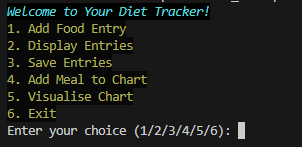
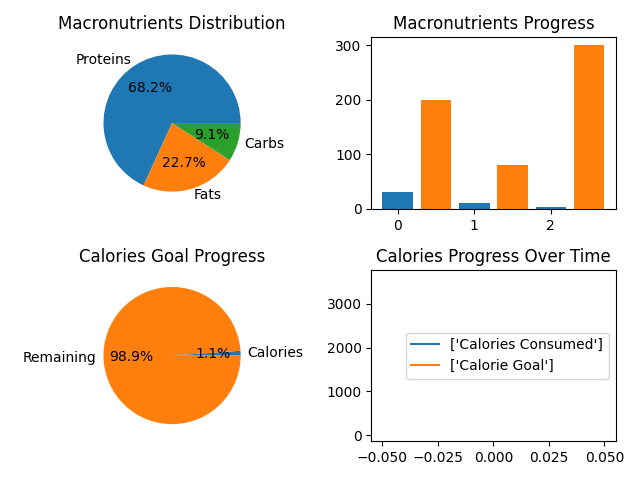
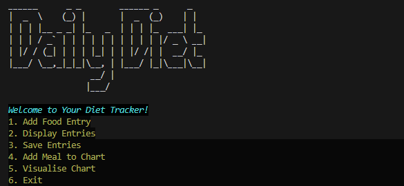

# Daily Diet created with Python by Khoi

## Brief

Daily Diet is a diet tracking tool assist people reach their diet goals. Created with Python, and user-friendly, easily accessible and usage.

### Key Features

- <b> Diet Entries:</b> Inputs users diet through out the day; Meal type, Name of food, Calories, Protein, Carbs, Fat.
- <b>Visualise Data</b> Creates charts based on users goals and diet entries.
- <b>View Entries</b> Shows users entries with Date, Meal type, Food, Calories, Protein, Carbs, Fat.
- <b>Delete Entries</b> Lets users delete any entries and access the text file.

<p align ="center">

</p>

## Source Control

- Github Repository - [Daily Diet](https://github.com/kaihx1/KhoiThai-T1A3-DietTracker)
- Clone Repository - `git clone https://github.com/kaihx1/KhoiThai-T1A3-DietTracker`
    <br>

## Installation

1. Open a terminal.

2. Clone the GitHub repository via SSH or HTTPS:
SSH:

```sh
   git clone git@github.com:kaihx1/KhoiThai-T1A3-DietTracker.git
```
HTTPS:

```sh
    git clone https://github.com/kaihx1/KhoiThai-T1A3-DietTracker.git
```
3. Check in to the `/src` directory:
    ```sh
    cd KhoiThai_T1A3_prac/src
    ```
4. Type out manually to create the run.sh bash script:
    ```sh
    chmod +x run.sh
    ```
5. Run the run.sh script:

    ```bash
    ./run.sh
    ```

<br>

## Prerequisuites

    - Python 3
    - Bash
    - Git

    <br>

## Dependencies

This application uses the following Python libraries:

    - [pyfiglet](https://pypi.org/project/pyfiglet/): A Python full port of FIGlet. A program that renders typefaces and ASCII characters, used in this application for text headers in the terminal interface.
    - [colored](https://pypi.org/project/colored/):  A libary for terminal text coloring. Used in this application for color and style choices in the text terminal interface.
    - [numpy](https://pypi.org/project/numpy/): A library used for working with arrays. Used in this application for linear-algebra and matrice.
    - [matplotlib](https://pypi.org/project/matplotlib/): A Python library used for data visulisation. Used in this application for diet visulisation in graphic metrics.
<br>

## Features

- **Daily Diet Tracking**: When you run the application, you will be faced with two options to add your diet entries. Option 1, `Add Food Entry` Lets you add your food you've consumed for the day, showing the day you've added them all into a seperate text file. Option 2 `Display Entries`, lets you view your diet entries in a txt file, with name, protein, fat, carbs, and date. Option 3 `Save Entries` saves your entries into the txt file, it writes in inputs you've made. Option 4 `Add Meal to Chart` is a seperate entry to let you add your diet entry to view into a chart; Option 5 `Visualise Chart` lets you view this chart, it lets you see your Calories, protein, carbs, fat consumed vs goal, into four different graphs, with percentages as metrics.

- **Diet Visualisation**: Using numpy and matplotlib, option 4 and 5 allows you to view your diet into graphs, this is split into four different graphs. Top left graph shows the distribution in Macronutrients in a pie chart, this lets you view how much of each macros you've consumed, letting you track your macro for your diet goals. Top right graph is a bar chart of your macronutrients progress agaisnt the limits(goal), useful to view your diet goal agaisn't your consumption. Bottom left graph is a pie chart of your Calorie goal progress, it is your calorie consumption agaisnt the calorie limit(goal, in orange). Bottom right is a chart to view your Calorie progression over time, allowing you to view how much youve consumed over the days/week, whether your consuming less or more etc.

- **Text file and CSV file**: In options 3, it saves your diet entries into a csv file, allowing personal data accessing, it lets you keep your diet tracked even if you exit the terminal. It uses the csv file to write into the .txt file, with any missing inputs. The .txt file generated from option 2 shows your diet entries to help you keep track of your entries.

## Code Style Guide

This project adheres to the [PEP 8](https://pep8.org/) style guide for Python code. PEP 8 is a set of recommendations for how to format Python code to improve its readability and consistency. It covers topics such as indentation, variable naming, and line length.

<br>

## Screenshots

- **Graphs** 

    <p align ="center">
    
    </p>

- **Interface**

    <p align ="center">
    
    </p>

- **Files**

    <p align ="center">
    
    </p>

    <p align ="center">
    
    </p>